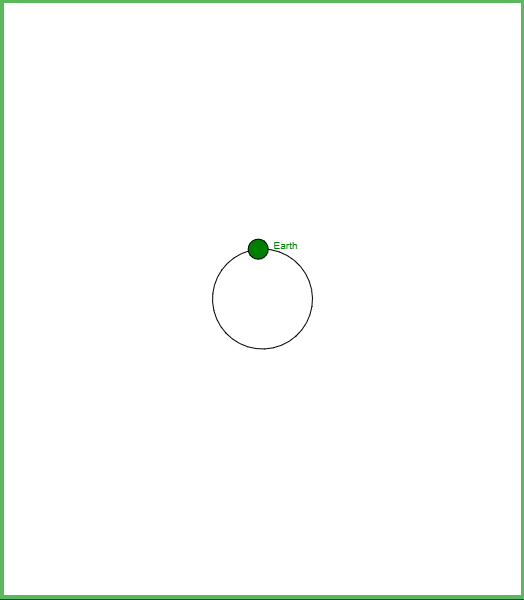
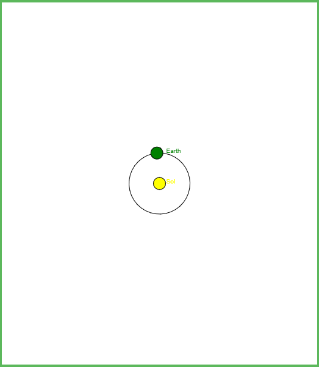
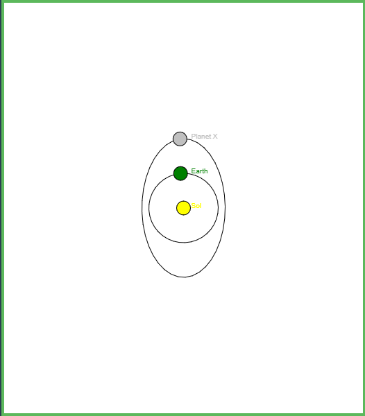
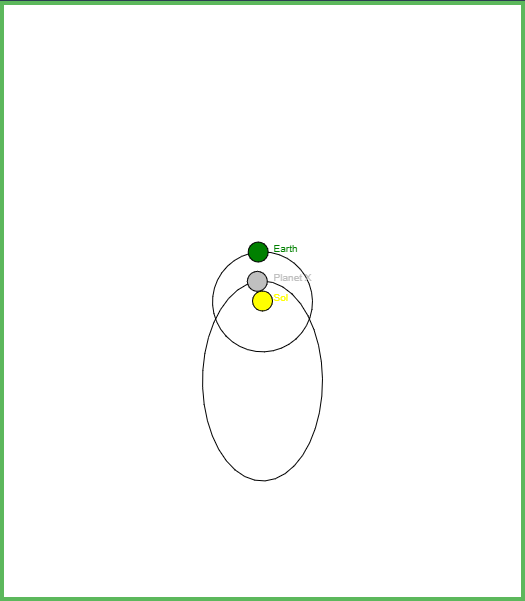
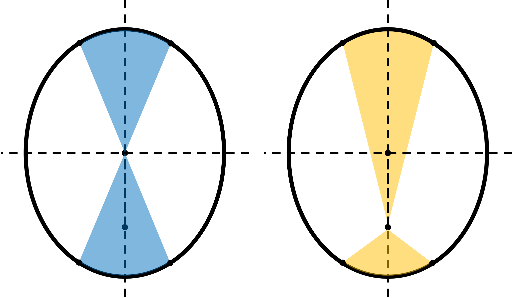
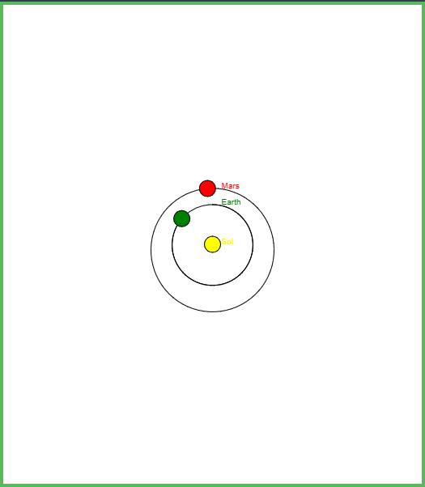

# Planetary Motion

Find this assignment at https://github.com/kmsherbert/PlanetaryMotionLab

The file `planetarymotion.py` in this repository contains a Python program which simulates planetary motion about the sun.

However, it's a little broken.
You are going to help fix it, so that it satisfies *Kepler's Laws of Planetary Motion*.

### Running Python

If you don't have Python on your computer, or if you're not sure how to use it, you can run it through a browser here:
    https://pythonsandbox.com/turtle

Just copy and paste all the code from `planetarymotion.py` and paste it into the text editor at that website.

The assignment will ask you to make changes to the program.
Be sure to save a copy (or email it to yourself) once you are done!

While it isn't necessary for this assignment,
    you are encouraged to peruse [this page](https://docs.python.org/3/library/turtle.html)
    if you want to learn more about how to use Python for graphics.

### Background

##### Kepler's Laws

1. The orbit of a planet is an *ellipse*, with the Sun at one of the two *focal points*.
2. A *line segment* joining a planet and the Sun sweeps out *equal areas* during *equal intervals of time*.
3. The *square* of a planet's *orbital period* is proportional to the *cube* of the *semimajor axis* of its orbit.

Kepler inferred these laws by carefully studying astronomical measurements of the positions of each planet in the night sky over a period of years.
These Laws would later provide the empirical framework for which Isaac Newton inferred his Laws of Motion and of Gravity,
    and to this day they remain amongst the most celebrated and impactful successes of observational science.

##### Ellipses

An ellipse is defined by selecting two *focal points* $\mathbf{F_1, F_2}$, and a length $a$.
For every point on the ellipse, the average of the distances to both focal points is exactly $a$.

More commonly, ellipses are specified by a single central point $\mathbf{O}$ (the *origin*) and the following two parameters:
- Semimajor axis ($a$): the distance from the central point and the furthest point on the ellipse.
- Eccentricity ($e$): the distance from the central point to one of the focal points, relative to $a$.

When eccentricity $e=0$, the central point $\mathbf{O}$ and both focal points $\mathbf{F_1, F_2}$ all coincide. This makes a circle!

### Exercises

0. Run the program without making any changes first, to make sure it works.

   > Your simulation should look something like this.

   

### Kepler's First Law
Right now, the planet's orbit is an ellipse.
But Kepler's First Law states that the orbit must be around the *Sun*. Where is the Sun?!

1. Add in a new "planet" with $a=0, e=0$. (What should we name it?)

   > Hint: All the planets will go into a *list*, which is defined inside of square brackets `[` `]`.
   > Find the list where the Earth is defined, and add another item just like it inside the same brackets.

   > Your simulation should now look like this:

   

2. Right now, the simulation puts the sun at the very center of the ellipse. (Where *should* it be?)
   Since the orbit of the Earth is so close to a circle, we can't see the problem very well.
   Let's add in a new, hypothetical planet with a much higher eccentricity.
   Use $a=2.0 \mathrm{AU}$ and $e=0.8$.
   Name it something creative!

   > Your simulation should look something like this. Notice that the Sun is in the center of the ellipse.

   

3. The simulation is wrong because the function `ellipse_focus` is supposed to give the distance from the center of the ellipse to the focus. Fix it!

   > Hint: Use the asterisk symbol `*` to multiply two variables in Python.

   > Your simulation should now look like this:

   

### Kepler's Second Law
Even though we fixed the shape of the orbits, there's still a problem.

Right now, each planet sweeps out equal areas with respect to the center of the ellipse in any given interval of time.
But that means the area swept with respect to the _Sun_ is _smaller_ when the planet is _closer_ to the sun,
    and _larger_ when the planet is _farther_ from the sun!

In reality, in any given interval of time, planets should sweep out equal areas with respect to the Sun.

This is actually a very challenging feature of planetary motion to simulate, and I won't ask you to do it.
For now, I'll be satisfied if you can answer the following conceptual questions:

4. In order for a planet to sweep out more or less area in the same interval of time, what physical quantity needs to change?

5. Should this physical quantity be larger or smaller than the average when the planet is closest to the sun? When it is farthest?

   > You can reason this out by thinking about the area swept out in a fixed interval of time, *OR* you can use the *conservation of energy*. Remember $K=\frac{1}{2}mv^2$ and $U=-GMm/r$.

6. Identify which part of the code would have to change to make the simulation consistent with Kepler's Second Law. (You don't have to make the change!)

### Kepler's Third Law
Right now, our simulation has every planet complete a single orbit at the same time.
In reality, planets farther from the sun should take longer (so we say they have a longer *orbital period*).

Kepler's Third Law tells us that the orbital period is related to the semimajor axis in the following way:

$$T^2 = k a^3$$

The $k$ here is some constant number. Kepler's Third Law doesn't tell us what value k has, but it *does* tell us that every planet in the same solar system should have the same value of $k$.

7. What are the units of $k$?

8. What is the value of $k$ for our solar system?

9. The function `ellipse_period` is supposed to give the orbital period for a planet in our solar system. Fix it!

   > Hint: Use the forward slash `/` to divide two variables in Python.

   > Hint: Use two asterisks `**` for exponents in Python. For example, `x**3` will compute $x^3$.

   > Hint: To compute square roots, use the special `sqrt` function.

10. Check your work by adding the planet Mars ($a=1.5273 \mathrm{AU}, e=0.093$) to the simulation. (You can remove the hypothetical planet you made earlier, if you'd like.)

    > Mars is observed to have has an orbital period of 1.8809 years. Run your simulation for that long.
    > Did Mars just complete its first orbit? Your simulation should look like this:

    

### The Solar System

11. Research the semimajor axes and eccentricities of other objects in the solar system, and add them in!

    > All the major planets have very small eccentricities. The most interesting objects to add are comets!

# Shortcomings in this Simulation
- We haven't fixed Kepler's Second Law! Planets should speed up and slow down throughout their orbits, but we haven't done that here.
- We've been simulating motion in two dimensions, but real planets move through space in *three* dimensions! While the orbit of any single planet is normally a two-dimensional ellipse, different planets' orbits may be *tilted* with respect to one another. Astronomers refer to the amount of tilting (with respect to Earth's orbit) as the *angle of inclination*.
- Kepler's laws can be derived from Newton's laws of motion and gravity. But Newton didn't have the final say! When Einstein's theory of general relativity is taken into account, planetary orbits are no longer precisely elliptical. But Newton's laws describe all the same physics except when gravity is *very* strong, so Mercury, which is closest to the Sun, is the only planet for which this effect is particularly noticeable.